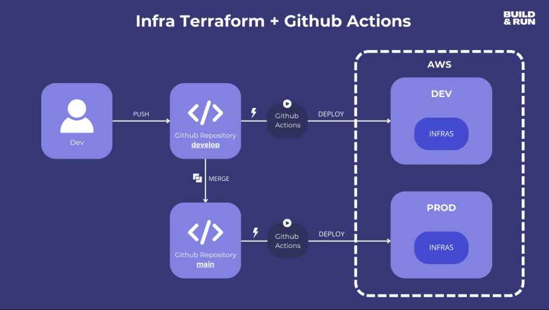
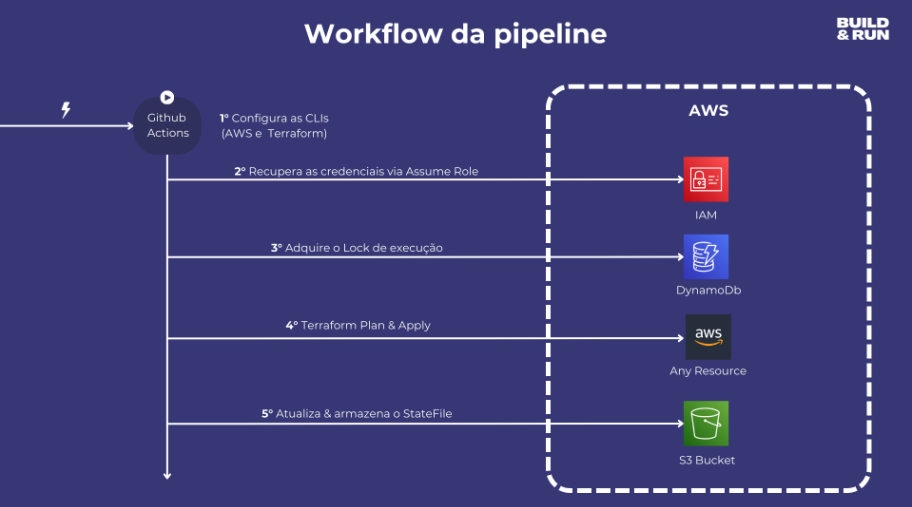

# Pipeline de Infraestrutura (AWS + Terraform + GitHub Actions)

## Visão Geral

Uma visão rápida do fluxo da pipeline e do workflow da infraestrutura.

## Fluxo da Pipeline (exemplo)


*Figura 1: Diagrama do fluxo da pipeline (exemplo).* 

## Workflow da Pipeline


*Figura 2: Workflow da pipeline mostrando triggers e etapas.*

## Como começar

1. Configure as secrets no GitHub: `AWS_ACCESS_KEY_ID`, `AWS_SECRET_ACCESS_KEY`, `AWS_REGION` (usar `us-east-2`).
2. Proteja o Environment `production` antes de permitir o `apply` manual.
3. Para rodar localmente (dev):

```powershell
cd Infra
.\scripts\init-and-plan.ps1 -Env dev
```

## Documentação rápida
- Backend: `Infra/backend-dev.hcl` (usa o bucket existente e `us-east-2`).
- Variáveis: `Infra/envs/dev/terraform.tfvars` e `Infra/envs/prod/terraform.tfvars`.

## Cuidados importantes
- O backend do Terraform (S3 + DynamoDB para lock) armazena o state. NÃO altere os
  valores do backend (bucket/key/region) sem validar: mover o backend pode causar
  perda de acesso ao state ou criar estados duplicados.
- Os arquivos em `Infra/envs/*` contêm nomes literais de buckets/recursos. Alterações
  nesses arquivos devem ser feitas com revisão e, preferencialmente, em coordenação
  com a equipe responsável pelo ambiente.
- Em CI (GitHub Actions) a região e o bucket do backend são passados via inputs ao
  workflow e exportados como `TF_VAR_aws_region` e `TF_VAR_bucket_name` durante a execução.
- Ao rodar localmente, exporte `AWS_REGION` ou defina `TF_VAR_aws_region` e verifique
  que suas credenciais/role tenham permissão para acessar/criar o bucket (s3:CreateBucket,
  s3:ListBucket, s3:GetObject, s3:PutObject).

## Troubleshooting rápido: problemas com bucket S3

- Erro "InvalidBucketName" ao criar o bucket:
  - Causa: o nome do bucket não atende às regras do S3 (maiusculas, caracteres inválidos, comprimento > 63, começa/termina com '.' ou '-').
  - Ação: escolha um nome válido (minúsculas, 3-63 chars, apenas a-z, 0-9, '-' e '.') ou habilite o input `allow-create-bucket` no workflow para que o pipeline tente criar um bucket fallback sanitizado.

- Permissões negadas (AccessDenied):
  - Causa: a role/credenciais usadas pelo runner não têm permissão para criar ou acessar o bucket.
  - Ação: conceda permissões IAM mínimas: s3:CreateBucket (se for criar), s3:ListBucket, s3:GetObject, s3:PutObject, s3:PutBucketVersioning e kms:Encrypt/Decrypt se estiver usando KMS.

- Bucket já existe (BucketAlreadyExists):
  - Causa: o nome escolhido está em uso no namespace global do S3.
  - Ação: escolha um nome único (adicionar sufixo com hash ou account id) ou forneça um bucket existente ao workflow.

## Como usar o input `allow-create-bucket`

- No GitHub Actions (via UI) ao executar o workflow, marque `allow-create-bucket` = true para permitir que o workflow crie automaticamente um bucket fallback se o bucket fornecido não existir.
- Atenção: a criação automática só funcionará se a role/credenciais do runner possuírem permissão `s3:CreateBucket`.

---


